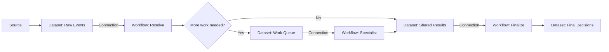

# GTM System Explanation Framework

Sections: required narrative order, mental-model language, diagrams, walkthrough formula, tables, tone, and detail selection.

Read [output-layout.md](output-layout.md) before drafting. It is the required final-answer contract.

## Required Narrative Order

1. **Building blocks:** open with the plain-language object model.
2. **Connection rule:** state that Workflows do not watch Datasets by themselves.
3. **The normal path:** show the complete material route in Mermaid.
4. **Numbered guided tour:** explain each important Dataset and Workflow in execution order.
5. **What the final Datasets mean:** distinguish receipts, queues, evidence, and durable business output.
6. **The fallback path:** show its own diagram and bounded retry behavior when material.
7. **How integrations fit in:** distinguish lookups, enrichment, coordination, and writes.
8. **What becomes automatic later / Current operating state:** end with explicit trigger and safety state.

Do not lead with an executive summary. Let the opening mental model orient the reader, then explain the actual system.

## Mental-Model Language

- Workbook: “the overall container.”
- Dataset: “a table or inbox that holds rows.”
- Workflow: “a recipe that processes one row.”
- Connection: “the conveyor belt that sends Dataset rows through a Workflow.”
- Source: “what creates the original row.”
- Integration: “an outside service the Workflow consults or writes to.”

Adapt the words to the audience, but preserve the distinctions.

After the definitions, state the relationship directly:

> A Workflow does not continuously watch a Dataset by itself. The connection determines when a row is sent through that Workflow.

## Diagram Rules

- Prefer one normal-path diagram with roughly 6–14 nodes. Preserve material Dataset handoffs and business branches even when that requires a slightly larger diagram.
- Add a separate fallback diagram instead of tangling every exception into the main flow.
- Put object type in the label when ambiguity matters: `Dataset:`, `Workflow:`, `External:`.
- Label branch decisions with the business condition.
- Use solid arrows for active/current movement.
- Use dotted arrows for exception or explicitly future movement.
- Do not include IDs in diagrams unless two objects share a name.
- Ensure every arrow exists in the journal path model.

Generic pattern:

## Walkthrough Formula

Give each important stage its own numbered `###` heading. Then answer five questions:

1. What arrives?
2. What does this Workflow decide, normalize, or learn?
3. Which integrations does it consult?
4. Where does the result go?
5. Why does that handoff exist?

This prevents node dumps and makes system purpose memorable. Use short paragraphs for the stage purpose and bullets for sources, actions, integrations, fields, or branch destinations.

## Tables

Use a Dataset table when three or more tables have distinct roles:

| Dataset | Purpose |
|---|---|
| `<name>` | `<one business sentence>` |

Use an integration table when three or more external systems are involved:

| Integration | Where used | Purpose | Current behavior |
|---|---|---|---|

Use a connection/state table when trigger policy is central:

| From | Workflow | To | Now | Later |
|---|---|---|---|---|

Name the Dataset section `## What the final Datasets mean` and the integration section `## How integrations fit in`.

## Tone

- Write for the recorded audience, usually a GTM operator.
- Use short, declarative sentences.
- Explain business responsibility before implementation detail.
- Prefer concrete verbs: receives, looks up, enriches, scores, stores, retries, blocks.
- Be explicit enough that the reader can follow a row without consulting the diagram again.
- Avoid internal node names unless they clarify a critical rule.
- Avoid praising complexity or narrating the inspection process.
- Do not force the reader to infer what is currently running.

## Detail Selection

Always include:

- the normal start and terminal result;
- the mechanism moving rows;
- major decision branches;
- fallback and safe-stop behavior;
- read versus write integrations;
- current automation and write state.

For repeated source-specific stages, group equivalent Datasets and Workflows under one numbered section, then list the sources. Do not produce dozens of repetitive sections.

Include IDs when:

- verifying an exact object;
- distinguishing same-named objects;
- handing off operationally.

Omit IDs when they interrupt comprehension and names are unambiguous.
