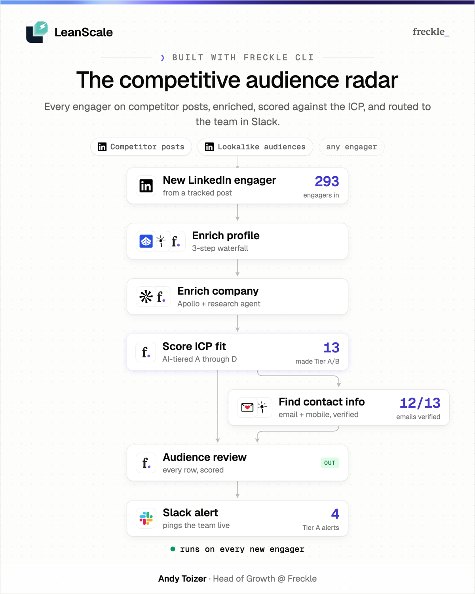

# share-freckle-workbook

Turn any Freckle workflow into a single shareable LinkedIn image — a stylized,
consolidated DAG on a product-canvas card with outcome stats and poster
attribution. Works in Claude Code, Codex, Cursor, or any coding agent with
shell access.



## Use it

**Easiest:** click **Share** on any workflow page in app.freckle.io and paste
the copied text into your coding agent. That's it — the agent bootstraps this
skill if needed and builds your card. (The payload contract lives in
[references/share-script.md](references/share-script.md).)

**Or install it as a native skill:**

```bash
cp -R share-freckle-workbook ~/.claude/skills/share-freckle-workbook   # Claude Code
cp -R share-freckle-workbook ~/.codex/skills/share-freckle-workbook    # Codex
```

Then invoke with `/share-freckle-workbook <Freckle workbook or workflow URL>`.

## Requirements

- The [Freckle CLI](https://install.freckle.dev), authenticated (`freckle auth`)
- Google Chrome (headless rendering)
- Node.js 20+ and Python 3

## How a run feels

You get a finished card first, questions after — one short message covering
only what's missing: a headline check, your logo (if your org doesn't have one
in Freckle yet), and optionally your headshot + job title for the footer.
Answers are saved to `~/.config/freckle/share-freckle-workbook/` on your
machine, so the next share asks one question or none.

Your logo comes from your Freckle org, or from a file you hand over — never
from a logo lookup service, so a card can't end up wearing the wrong company's
mark. If you supply one, the skill offers to add it to your Freckle org so
it's there next time. Until then the header shows your org name as text, which
is a deliberate look rather than a fallback.

## How it works

`SKILL.md` is the pipeline: resolve the workflow via the Freckle CLI →
consolidate 30+ real nodes into 5–8 stylized ones → compute positivity-gated
outcome stats → emit a spec JSON → deterministic HTML/Chrome render at 2x with
a mandatory 540px feed test → deliver, refine once, done. Design rules live in
`references/`, the renderer in `renderer/`, example specs in `fixtures/`, and
the Share-button product spec in `docs/share-button-spec.md`.
